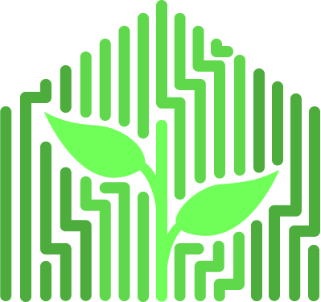

# Greenwatch

  

## Greenwatch's Purpose

To provide a way to measure and record environmental data in a greenhouse and
be able to present that data in a meaningful web application that allows for 
insightful interpretation of the data. While working on the second iteration our goal was to implement
a web application that displays four primary units of measurement: temperature, humidity, pressure
and light. As well updating the user interface to look more modern, editing existing code to send measurement data to the backend server, etc.  
While we have created the ability for actions such as opening shades and vents, possible future iterations may include implementing actual funtionality with the actions.
  
## Documentation

Within the [Docs](https://github.com/Vizemo/GreenWatch/tree/production/Documentation) folder is a collection of the
Greenwatch's project documentation including a extensive user manual for all things `GreenWatchv2`. 
Reference this folder for any questions you have about the purpose, architecture, or 
even the code itself. 

## Version Control Workflow

In order to keep workflow the same, the next user may want to note that there are several different
branches. In order to keep past working versions to work create your own branch. For example, creating
your own develop branch should be the first step in order to start coding `yourname-develop`. Note that 
if you modify the original branch it may cause more issues than it solves. 

Our workflow was structured as follows, final product is merged to production, if no final product exist
this means you are in the development process. If this is the case each "developer" should create their 
own develop branch (as seen in the paragraph above). When changes have been made and are successful everyone 
should merge their personal branch with the communal develop branch labeled `develop`. 

## Setup - Just Python with SQLite

To get the application running in a test/development environment all
you need is a machine with python 3.6 or higher and pip installed as the primary 
package manager. Also, you will want to use git to clone the repo and follow the below steps.

1. clone the repo into a directory of your choice and tunnel into the root of the project  
2. git clone https://github.com/Vizemo/GreenWatch.git   
3. cd GreenWatch

if you would like to do it with a virtual environment build it now and activate
  pip install virtualenv
  virtualenv venv
  'source ./venv/Scripts/activate'  Windows
  'source ./venv/bin/activate'      Bash
  

4. we will now install all packages needed to run the application, run this command  
  pip install -r requirements.txt

All packages should be downloaded.   
5. Next, go to /.flaskenv and open the contents.
   Below lines detail the configuration you need in .flaskenv to run the app locally. 
   Make the changes to reflect the lines below and save the file.  
    FLASK_DEBUG=1  
    PRODUCTION=0  
    SERVER_IP="127.0.0.1:5000"  

6. Now in the root directory of the repo type the below command into a terminal  
      flask run

You now are running Greenwatch and will be brought to the login page of the
server when you go to the 127.0.0.1:5000 in your browser. 

### Note
If you are going to do the docker options, It is expected of you to have used  
docker and have it installed ready to use.   

## Setup - Docker development - PostgreSQL DB  

1. simply from the root access type the below commands  
docker-compose --file docker-compose.yml build  
docker-compose --file docker-compose.yml up  
  
2. If you would like to change any details about the database simply go to  
/.flaskenv and you would find all variables needed to configure the connection  
string to the postgresql database.   

## Setup - Docker production (Full posgresql/nginx/gunicorn deployment)  

1. go to /.flaskenv and change these values  
FLASK_DEBUG=0  
PRODUCTION=1  
SERVER_IP="Public ip of server (ex: 40.122.52.52)"    
  
2. simply from the root access type the below commands  
docker-compose --file docker-compose.prod.yml build  
docker-compose --file docker-compose.prod.yml up  
  
3. you now have three seperate containers all working in conjunction with one another  
firstly, the python flask app using gunicorn as the WSGI server on alpine linux  
secondly, the postgreSQL database you configured in /.flaskenv  
thirdly, the nginx web server running on port 80  
  
## User Interface
  
The [UserInterface](https://github.com/Vizemo/GreenWatch/tree/production/UserInterface) folder includes all of the static html files, the javascript files that    
manipulate DOM to create dynamic html files, and the css files that style the login page. There are also javascript utility scripts that include    
functions that are   repeatedly used accross multiple files. The javascript files making the API fetch requests are also stored within the [UserInterface]    
(https://github.com/Vizemo/GreenWatch/tree/production/UserInterface) folder.  

## Backend  
  
[Backend](https://github.com/Vizemo/GreenWatch/tree/production/Backend) Contains the code of the [Agents]   
(https://github.com/Vizemo/GreenWatch/tree/production/Backend/Agent), that run on the Raspberry Pi to take sensor data, and the [GreenhouseServer]  
(https://github.com/Vizemo/GreenWatch/tree/production/Backend/GreenhouseServer) that acts as a proxy to push the agent data from the greenhouse to  
whatever remote server is running the Greenwatch application.  
  

## Contributors  
As a team we all worked on code and documentation equally, while also leaning into eachothers strengths. It should
be noted that we also tackled problems outside of our set of skills in order to broaden our skill base. Lastly all team
members worked on documentation.

Each team members skills will be listed next to their names. 

- [Calvin Walmer](https://github.com/CalvinWalmer) `Engineering/Backend/Leadership`
- [Sharome Burton](https://github.com/koulkoudakis) `Engineering/Backend`
- [Victor Marchesi](https://github.com/Vizemo)  `Deployment/General Coding`
- [Delton Hughes](https://github.com/dHughes97) `Front-End/UX Design`
